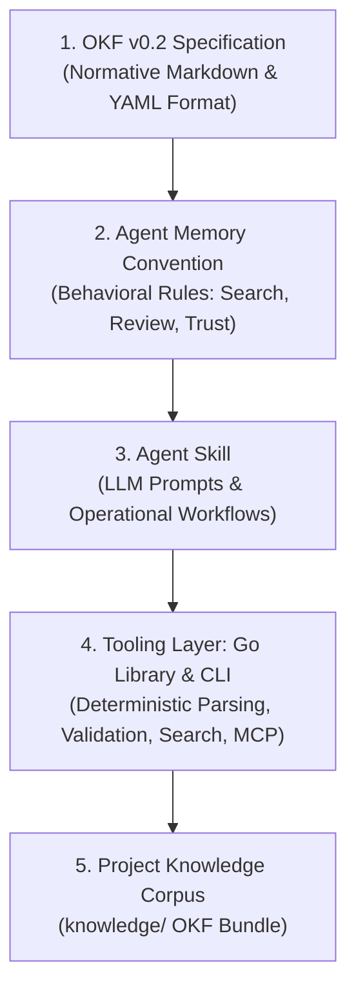

# OKF Agent Memory

> **A Domain-Neutral, Git-Native Persistent Project Memory for AI Agents based on the Open Knowledge Format (OKF) v0.2.**

[](https://github.com/GoogleCloudPlatform/knowledge-catalog/blob/main/okf/SPEC.md)
[](pkg/okf)
[](cmd/okf)
[](LICENSE)

---

## 🌟 Overview

Conversations with AI agents reset when context windows close. Valuable architectural decisions, domain discoveries, and operational facts are lost unless stored persistently.

**OKF Agent Memory** provides a standardized, vendor-neutral memory layer that lives directly in your repository (`knowledge/`) as plain Markdown files with YAML frontmatter. It bridges the gap between unstructured ad-hoc markdown files (`CLAUDE.md`, `AGENTS.md`) and complex, black-box vector databases.



---

## ⚡ Key Highlights

* **Blazing Fast Performance (<300µs Search, ~4ms Graph Validation)**: In-memory BM25 retrieval and bundle validation execute in microseconds without VM spin-up or network roundtrips.
* **100% Git-Native & Zero Vendor Lock-in**: Everything is version-controlled plain text. Inspect, audit, and review your agent's memory using standard `git diff` and `git log`. No external database required.
* **Zero API Costs for Memory Retrieval**: Local lexical BM25 indexing eliminates recurring vector embedding API costs and network roundtrips.
* **Built on Google OKF v0.2**: Uses the open standard format for agent knowledge with full support for provenance (`sources`), trust tiers (`generated` vs. `verified`), and lifecycle metadata (`status`, `stale_after`).
* **Solves Context Bloat & Memory Rot**: Employs **Progressive Disclosure** (hierarchical `index.md` files and link graphs) so agents only load the exact concepts they need.
* **Search-Before-Write Principle**: Mandates querying existing memory before authoring, preventing concept duplication and hallucinated divergence.
* **Zero-Dependency Go Toolchain**: Single binary with **zero external dependencies**, sub-5ms CLI startup time, and a built-in **Model Context Protocol (MCP) server** (`okf mcp`).
* **Truly Domain-Neutral**: Designed for Software Engineering, Coaching, Scientific Research, Literature Reviews, and Operations.

---

## 🚀 Quickstart

### 1. Build the Tooling

Clone the repository and compile the standalone `okf` executable:

```bash
make build
```

This generates the standalone binary at `bin/okf`.

### 2. Basic CLI Commands

```bash
# Validate bundle conformance, graph connectivity, and description drift
./bin/okf validate knowledge --strict --drift

# Search concepts via in-memory BM25 scoring
./bin/okf search "architecture layers" knowledge

# Inspect a concept and its relationships (with --json support)
./bin/okf show architecture/layers knowledge --json

# Create a new concept with automated log.md and index.md bookkeeping
./bin/okf create decisions/auth-flow knowledge \
  --type Decision \
  --title "OAuth2 Authorization Flow" \
  --desc "Standardized on PKCE for client authentication."

# Update an existing concept
./bin/okf update decisions/auth-flow knowledge \
  --desc "Updated OAuth2 PKCE token refresh interval."

# Bootstrap full agent memory stack into any target project
./bin/okf bootstrap /path/to/project --name "My Project"

# Initialize only a bare OKF bundle in any directory
./bin/okf init my-project/knowledge
```

### 3. Bootstrapping Agent Memory in Any Project

Scaffold the complete OKF Agent Memory architecture into any new or existing repository with a single command:

```bash
# Bootstrap full memory stack into target project
./bin/okf bootstrap /path/to/my-project --name "My Service"
```

This automatically sets up:
* `knowledge/` — OKF v0.2 compliant persistent memory bundle (`index.md`, `log.md`)
* `.agents/skills/okf-memory/` — Embedded agent skill definition and capability guides
* `AGENTS.md` — Project-tailored operating instructions for AI coding agents
* `Makefile` — Convenience tasks for validation (`make validate`) and search (`make search q="..."`)

### 4. Running as an MCP Server

`okf` ships with a native Model Context Protocol (MCP) server over `stdio` to seamlessly connect with Claude Code, Cursor, Codex, and other agent platforms:

```bash
./bin/okf mcp knowledge
```

#### Example MCP Configuration (`claude_desktop_config.json` or Cursor):
```json
{
  "mcpServers": {
    "okf-memory": {
      "command": "/path/to/okf-agent-memory/bin/okf",
      "args": ["mcp", "/path/to/project/knowledge"]
    }
  }
}
```

---

## 📂 Repository Structure

```
okf-agent-memory/
├── cmd/
│   ├── okf/                # Standalone CLI and embedded MCP server (`stdio`)
├── docs/                   # Guides, specifications, architecture & release playbook
│   ├── ALTERNATIVES.md     # Comparison against Mem0, Letta, and ad-hoc markdown
│   ├── CLI.md              # Complete command-line & MCP tool reference
│   ├── CONVENTION.md       # OKF Agent Memory Convention v0.1
│   ├── GETTING_STARTED.md  # Comprehensive onboarding guide
│   ├── OKF-COMPATIBILITY.md# OKF v0.2 spec compatibility analysis
│   ├── ROADMAP.md          # Project roadmap & milestones
│   └── SECURITY.md         # Data governance, secret prevention & PII rules
├── examples/               # Domain-neutral reference OKF v0.2 bundles
│   ├── books/              # Literature & cognitive science knowledge bundle
│   ├── coaching/           # Executive coaching & client session bundle
│   └── software/           # Microservices architecture & ADR bundle
├── knowledge/              # Project's own OKF v0.2 persistent memory bundle
│   ├── index.md            # Root progressive disclosure index (okf_version: "0.2")
│   ├── log.md              # Dated change log (ISO 8601 YYYY-MM-DD)
│   ├── project/            # Overview & value propositions
│   ├── architecture/       # 5-tier architecture & tooling decisions
│   ├── convention/         # Principles & lifecycle workflows
│   └── roadmap/            # Milestones
├── pkg/okf/                # Zero-dependency Go core library (parser, validator, BM25, MCP, bootstrap)
├── AGENTS.md               # Operating instructions for AI coding agents
├── CONTRIBUTING.md         # Contribution guidelines & development workflow
├── Makefile                # Build, test, lint, validation & release targets
├── LICENSE                 # MIT License
├── README.md               # Main repository documentation
└── SECURITY.md             # Security policy & reporting guidelines
```

---

## 🧪 Testing & Verification

Run the full test suite and validate the repository's self-documenting knowledge bundle:

```bash
make check
```

---

## 📖 Further Documentation

* [Getting Started Guide](docs/GETTING_STARTED.md) — Comprehensive onboarding guide for agents and humans.
* [CLI & MCP Reference](docs/CLI.md) — Complete command-line and protocol tools reference.
* [Contributing Guide](CONTRIBUTING.md) — Development setup, quality gates, and pull request standards.
* [Security & Privacy Guidelines](docs/SECURITY.md) — Data governance, secret prevention, and PII protection rules.
* [OKF Agent Memory Convention v0.1](docs/CONVENTION.md) — Behavioral rules and lifecycle specification.
* [Project Roadmap & Milestones](docs/ROADMAP.md) — Phased development plan.
* [OKF v0.2 Compatibility Matrix](docs/OKF-COMPATIBILITY.md) — Specification validation analysis.
* [Why OKF Agent Memory?](knowledge/project/value-proposition.md) — Detailed value proposition & differentiators.
* [Alternatives & Ecosystem Comparison](docs/ALTERNATIVES.md) — Comparison with Mem0, Letta, and ad-hoc markdown files.

---

## 📄 License

MIT License. See [LICENSE](LICENSE) for details.
